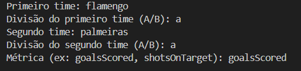
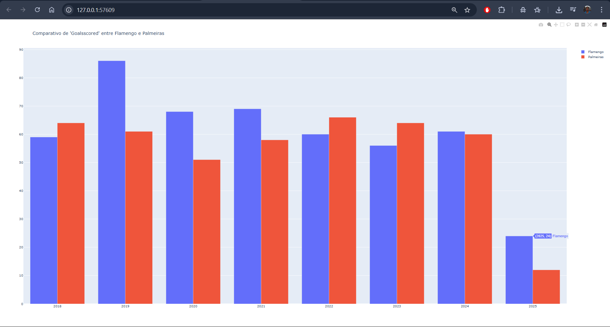

# Análise Estatística do Brasileirão (Séries A e B)

## Ferramenta para comparar estatísticas históricas (2018–2025) de clubes das Séries A e B do Campeonato Brasileiro, usando dados da API do SofaScore. Permite analisar e visualizar o desempenho dos times em tabelas e gráficos interativos.

## 🖼️ Demonstração

### 🔹 1. Entrada dos Dados



### 🔹 2. Execução e Scraping


### 🔹 3. Geração do Gráfico



---

## ⚙️ Como Funciona

- **Escolha dos Times:** Informe o nome e a divisão (A ou B) de dois clubes. O sistema valida os times e carrega os dados da API para cada temporada.
- **Coleta de Dados:** Para cada temporada de 2018 a 2025, o programa acessa a URL do SofaScore usando Selenium em modo headless, extraindo os dados em JSON.
- **Organização:** Os dados são convertidos em DataFrames pandas, com estatísticas por temporada para facilitar a análise.
- **Visualização:** Gráficos de barras interativos com Plotly mostram a comparação das métricas escolhidas entre os dois clubes ao longo dos anos.

---

## 📈 Métricas Disponíveis (exemplos)

- `goalsScored` (Gols marcados)
- `shotsOnTarget` (Finalizações no alvo)
- `shots` (Chutes)
- `goalsConceded` (Gols sofridos)
- `redCards` (Cartões vermelhos)
- `yellowCards` (Cartões amarelos)
- `corners` (Total de escanteios)
- `cleanSheets` (Jogos sem sofrer gols)

> Use os nomes idênticos aos retornados pela API.

---

## 📦 Requisitos

- Bibliotecas Python:
  - selenium
  - webdriver-manager
  - pandas
  - plotly

---

## 🚀 Instalação e Uso

```bash
git clone https://github.com/Cabana021/analise-brasileirao.git
cd analise-brasileirao
pip install -r requirements.txt
python main.py
```
